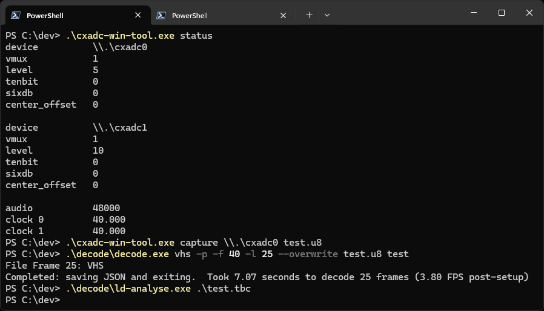
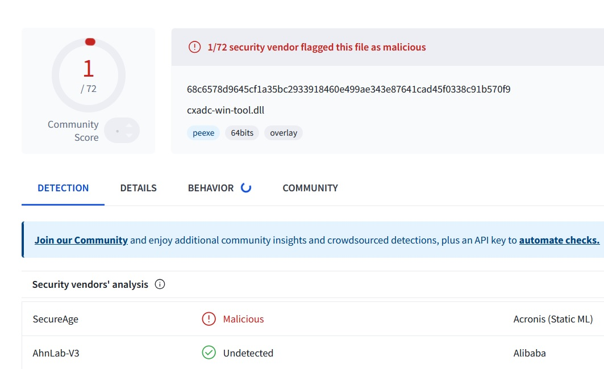

# cxadc-win - CX2388x ADC DMA driver for Windows
> [!WARNING]  
> ⚠️ **THIS IS EXPERIMENTAL AND SHOULD NOT BE USED IN A PRODUCTION ENVIRONMENT** ⚠️  

This was made for use with the [decode](https://github.com/oyvindln/vhs-decode) projects, see [here](https://github.com/oyvindln/vhs-decode/wiki/CX-Cards) for more information on these cards.  

## Usage
  

### Configure
`cxadc-win-tool scan`  
`cxadc-win-tool get <device>`  
`cxadc-win-tool set <device> <parameter> <value>`  

See [cxadc-linux3](https://github.com/happycube/cxadc-linux3) for parameter descriptions.  
Parameter       | Range | Default 
----------------|--------|--------
`vmux`          | `0-2`  | `2`
`level`         | `0-31` | `16`
`tenbit`        | `0-1`  | `0`
`sixdb`         | `0-1`  | `0`
`center_offset` | `0-63` | `0`

### Configure clockgen (Optional)
> [!IMPORTANT]  
> [Additional steps](#clockgen-optional) are required to configure clockgen  

`cxadc-win-tool clockgen audio get`  
`cxadc-win-tool clockgen audio set <rate>`  
`cxadc-win-tool clockgen cx get <clock>`  
`cxadc-win-tool clockgen cx set <clock> <value>`  

Value | Frequency (MHz)
------|----------------
`1`   | `20`
`2`   | `28.68686`
`3`   | `40`
`4`   | `50`

### Capture
> [!TIP]  
> Use Command Prompt instead of PowerShell if piping to `STDOUT`  

`cxadc-win-tool capture \\.\cxadc0 test.u8`  
`cxadc-win-tool capture \\.\cxadc1 - | flac -0 --blocksize=65535 --lax --sample-rate=28636 --channels=1 --bps=8 --sign=unsigned --endian=little -f - -o test.flac`  

### Example
```
cxadc-win-tool set \\.\cxadc0 vmux 1     # set cx card 0 vmux to 1 (bnc?)
cxadc-win-tool set \\.\cxadc1 vmux 1     # set cx card 1 vmux to 1 (bnc?)
cxadc-win-tool set \\.\cxadc0 level 0    # set cx card 0 level to 0 (amp?)
cxadc-win-tool set \\.\cxadc1 level 0    # set cx card 1 level to 0 (amp?)

cxadc-win-tool clockgen cx set 0 3       # set clock 0 to 40 MHz
cxadc-win-tool clockgen cx set 1 3       # set clock 1 to 40 MHz
cxadc-win-tool clockgen audio set 48000  # set audio sample rate to 48000 (recommended)

cxadc-win-tool status                    # show all device config
```

## Download
Builds are currently only available via [actions](https://github.com/JuniorIsAJitterbug/cxadc-win/actions). You must be logged in to download artifacts.  

## Pre-installation  
1. Disable Secure Boot in your BIOS  
2. Disable Signature Enforcement, this can be done by typing `bcdedit -set testsigning on` in an Administrator Command Prompt and rebooting  

## Installation
1. Open **Device Manager**  
2. Right click **Multimedia Video Controller**, click **Properties**  
3. Click **Update Driver...**  
4. Click **Browse my computer for drivers**  
5. Browse to the path containing **cxadc-win.inf** and **cxadc-win.sys**, click **Next**  
6. Click **Install this driver software anyway** when prompted

### Clockgen (Optional)
> [!NOTE]  
> This has only been tested with the [original](https://gitlab.com/wolfre/cxadc-clock-generator-audio-adc) clockgen, compatibility with [cxadc-clockgen-mod](https://github.com/namazso/cxadc-clockgen-mod) is not guaranteed (24/12/01)  

The [clockgen mod](https://github.com/oyvindln/vhs-decode/wiki/Clockgen-Mod) is configurable via `cxadc-win-tool`.  
1. Download the latest [libusb-win32](https://github.com/mcuee/libusb-win32) drivers  
2. Copy `bin\amd64\libusb0.dll` to `C:\Windows\System32`  
3. Copy `bin\amd64\libusb0.sys` to `C:\Windows\System32\drivers`  
4. Run `install-filter-win.exe` as Administrator, select **Install a device filter**  
5. Select `vid:1209 pid:0001 rev:0000 | USB Composite Device`, click **Install**	 

## Building
This has only been tested with VS 2022, WSDK/WDK 10.0.26100 and .NET 8.0.  

## Limitations
Due to various security features in Windows 10/11, Secure Boot and Signature Enforcement must be disabled. I recommend re-enabling when not capturing.  

## Known issues
#### Clockgen
- Windows reports incorrect audio sample rate, set to 48000 to avoid issues (24/12/01)
- The 3rd audio channel (HSW) does not work correctly (24/11/30) 

## Disclaimer
I take absolutely no responsibility for (including but not limited to) any crashes, instability, security vulnerabilities or interactions with anti-virus/anti-cheat software, nor do I guarantee the accuracy of captures.  

## My Compilation
Now you are at my fork repository, where i store a compiled windows version of the driver.
### **IMPORTENT!**
You need to be really sure that you know what you're doing!
You're downloading a compiled version of a GitHub project, so it could be anything. You shouldn't trust any compiled version on GitHub — **NOT EVEN THIS ONE!**

So before installing this on your main PC, test it on a virtual machine or an old, unused PC without internet access to make sure it's really what you want.

You've been informed, so I'm in the clear now. 😊

### **MY SCAN**
Another thing is that when I scanned this compiled artifact with VirusTotal, I noticed that SecureAge flagged it as malicious.
This is a Windows driver, so it uses low-level instructions that antivirus software typically doesn't like... 😵

  

## Credits
This is based on the [Linux cxadc driver](https://github.com/happycube/cxadc-linux3), without which this would not exist.  